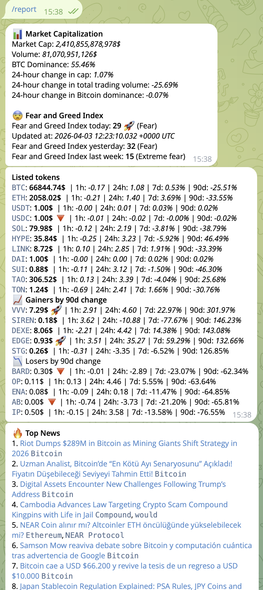

# Crypto Analyzer

Telegram bot for fetching real-time cryptocurrency market data, including global capitalization, Fear and Greed Index, token prices, DeFi protocols TVL, and AI-powered market analysis.



## Prerequisites

1. Get API keys from [CoinStats](https://openapi.coinstats.app/), [CoinMarketCap](https://pro.coinmarketcap.com/account) and [OpenRouter](https://openrouter.ai/settings/keys)
2. Create a Telegram bot and get the API token from [@BotFather](https://t.me/BotFather)
3. Get your Telegram User ID (you can use [@userinfobot](https://t.me/userinfobot) to find it)

## Environment Variables

```sh
export COINSTATS_API_KEY=<YOUR_API_KEY>
export API_KEY_COINMARKETCAP=<YOUR_API_KEY>
export OPENROUTER_API_KEY=<YOUR_API_KEY>
export TELEGRAM_API_TOKEN=<YOUR_TELEGRAM_BOT_TOKEN>
export TELEGRAM_USER_ID=<YOUR_TELEGRAM_USER_ID>
```

## Build & Run

Build the binary:
```sh
make build
```

Install the binary (installs to `/usr/local/bin/`):
```sh
make install
```

Run the bot:
```sh
crypto-analyzer
```

## Bot Commands

- `/report` — Generate and send crypto market report with AI analysis
- `/tokens ETH,BTC,SUIA` — Set observed tokens (comma-separated)
- `/protocols AAVE,UNISWAP,DRIFT` — Set observed DeFi protocols (comma-separated)
- `/config` — Show current configuration
- `/cron 12:15` — Set daily report generation time (UTC timezone)
- `/model google/gemini-3.1-pro-preview` — Set OpenRouter model for AI analysis

## AI Analysis

The bot uses OpenRouter to analyze market data and generate trading insights:
- Trend structure analysis
- Liquidity zones
- Momentum indicators
- Risk management recommendations

The AI analyzes your portfolio tokens, DeFi protocols TVL, and latest news to provide actionable insights.

## Configuration

The bot stores your configuration in `crypto-analyzer.json` file in the working directory. This file contains:

- **tokens**: List of tokens to monitor
- **protocols**: List of DeFi protocols to track
- **openrouter_model**: Model used for AI analysis
- **cron_next_execution_time**: Scheduled report time
- **chat_id**: Telegram chat ID for scheduled reports

The configuration file is automatically created when you first set tokens or protocols using the bot commands.
